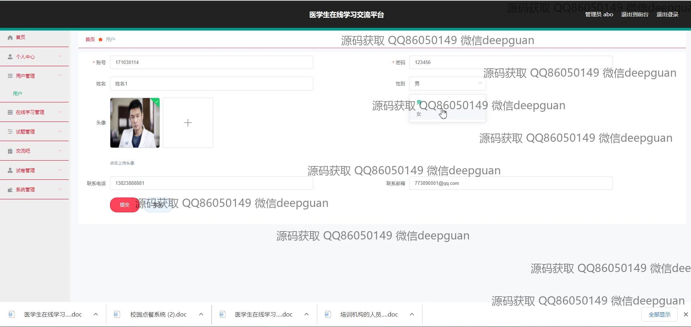

<h1 align="center">医学生在线学习交流平台+vue</h1>

## 简介
医学生在线学习交流平台：提供用户注册登录、课程管理、在线学习、互动交流、试题管理、考试管理及个人信息管理等功能，提升学习效率与互动体验。    --计算机毕业设计源码；毕设源码；java毕业设计源码

## 联系方式

<h3 align="center">获取完整代码与数据库文件 + 微信：deepguan QQ: 86050149 QQ群: 783742310</h3>

<h3 align="center">可帮忙远程部署 包运行成功！提供远程部署、修改代码、设计文档指导、代码讲解等服务！</h3>

## 功能介绍（完整见运行截图）
管理员：基本功能包括用户登录、注册和角色分配，支持课程管理、试题管理、用户信息管理，帮助和指导用户正确使用平台功能。管理员可以查看和修改用户信息，管理课程和试题，并进行系统维护与更新，通过导航菜单快速访问各功能模块。 用户：平台提供便捷的用户登录和注册功能，支持学习和交流模块。用户可以浏览课程列表、查看考试安排、参与在线学习讨论、查看学习进度，还可在交流区留言和互动，获取学习资料和资源。用户中心提供个人信息修改、考试记录查看、收藏管理等功能，操作简便。 医学生：平台为医学生提供丰富的医学课程资源和在线学习工具，支持个性化学习和实时互动。医学生可以通过课程管理模块选择课程、跟踪学习进度、参与课程讨论，提升学习效果。系统提供试卷管理、错题本、个人发布和考试记录等功能，帮助医学生管理学习任务，优化学习过程。 访客：访客可以通过平台主页和导航菜单快速了解在线学习交流平台的各类功能模块，并体验部分公开课程和公开讨论区。访客可以浏览平台页面，查看课程介绍和学习交流内容，但需注册和登录后才能访问更深入的学习资源和功能模块。

## 运行截图

本代码来源于网络,仅供学习参考使用!

